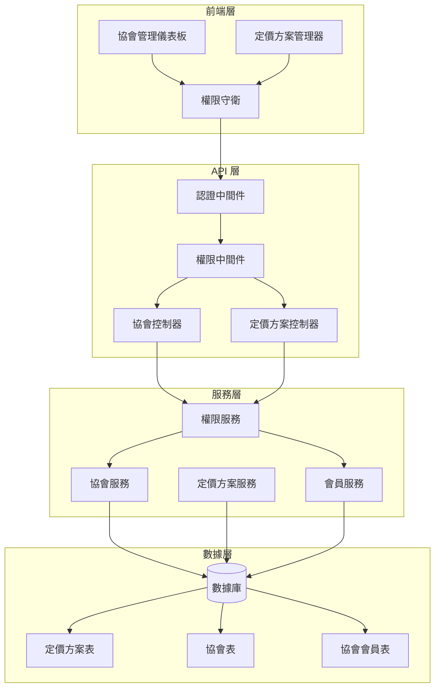
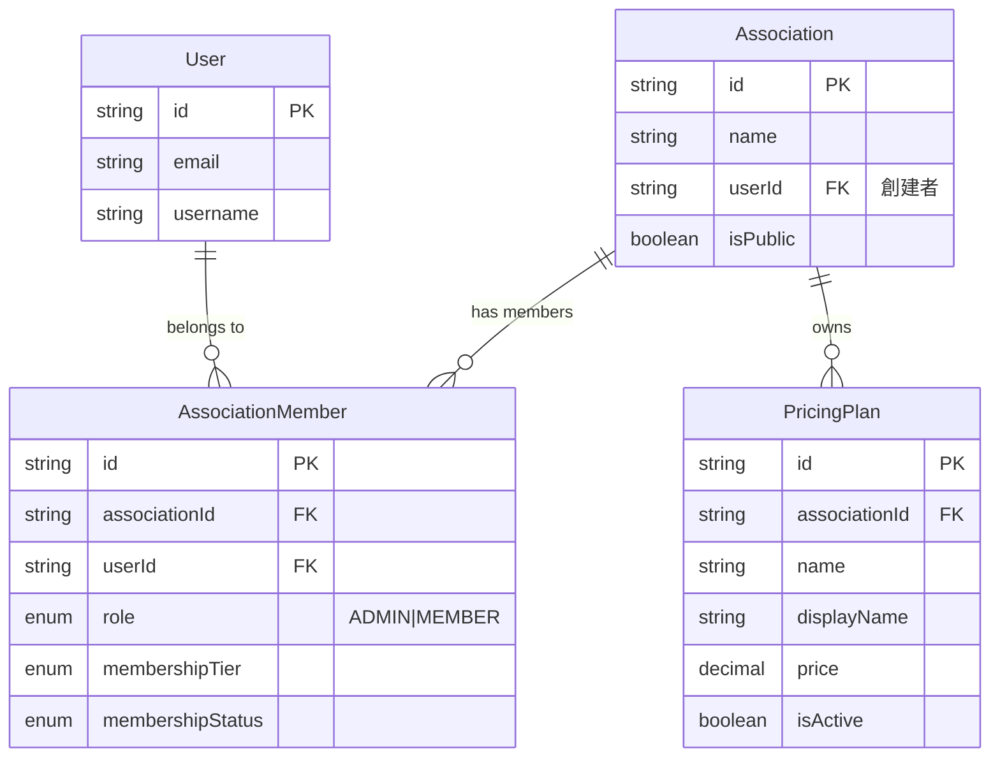
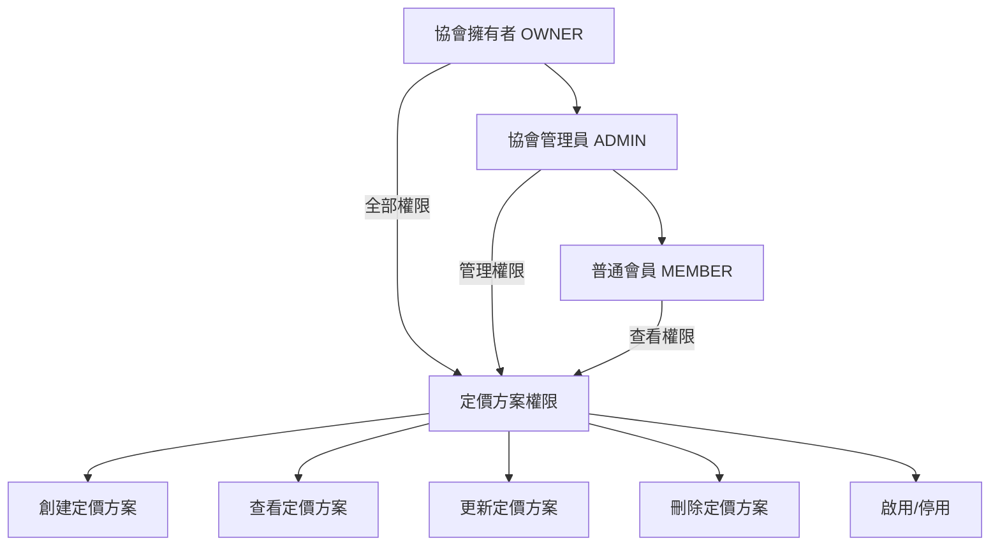
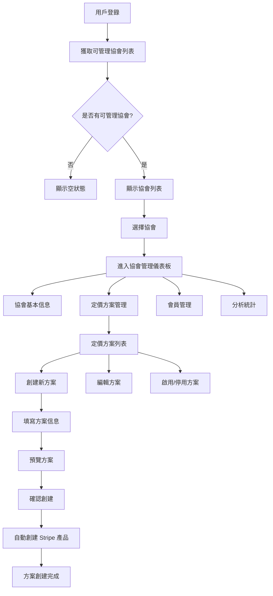
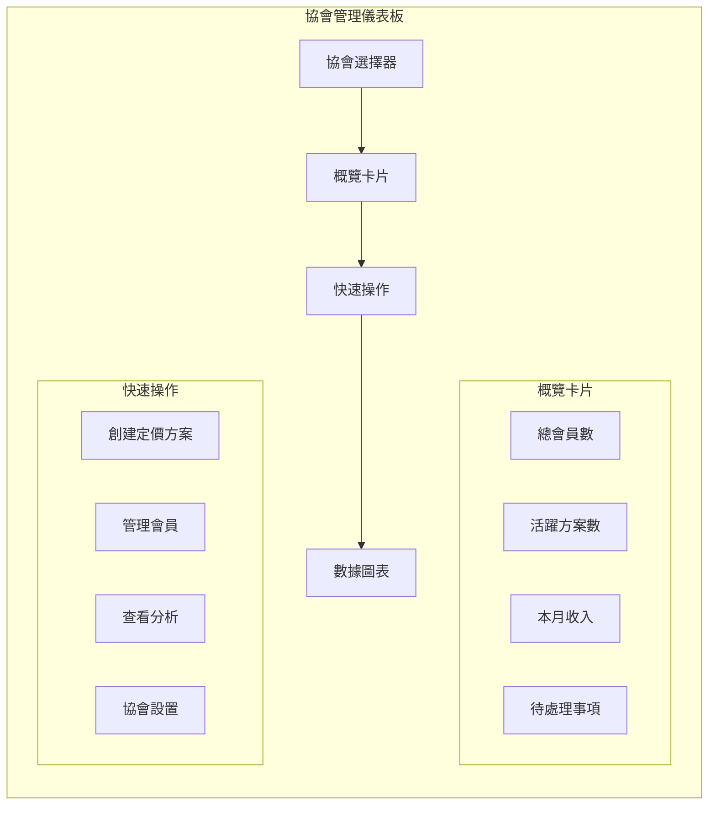
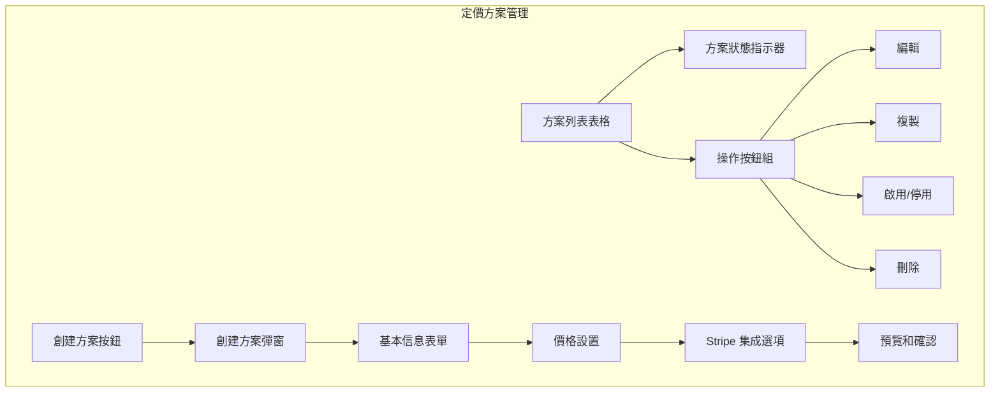
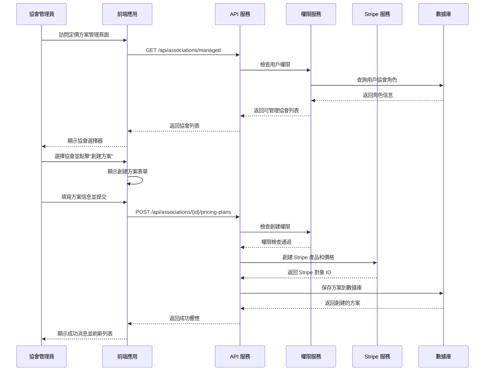
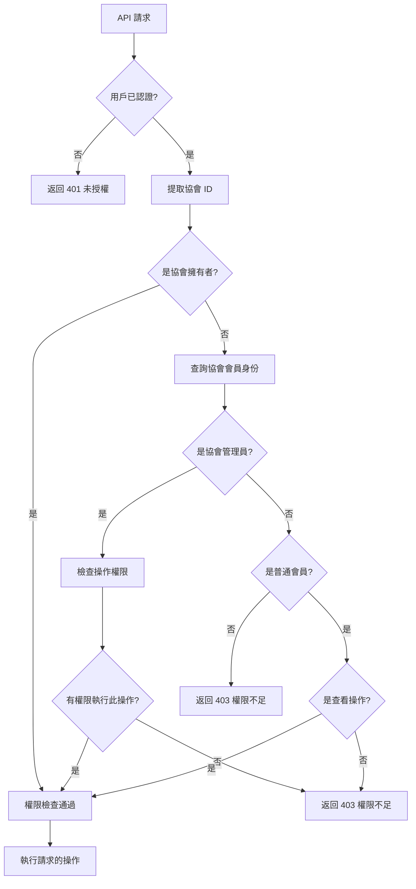

# 協會定價方案管理系統重構提案（File Name: 20250616_ASSOCIATION_PRICING_MANAGEMENT_PROPOSAL.md）

## 📋 執行摘要

本提案旨在解決當前支付系統中的權限管理漏洞，並建立一個完整的協會定價方案自助管理系統。通過實施基於角色的訪問控制（RBAC）和重構 API 架構，讓協會管理員能夠安全、便捷地管理自己的定價方案。

## 🎯 業務目標

### 主要目標
- **賦權協會管理員**：讓協會擁有者和管理員能夠自主管理定價方案
- **提升安全性**：修復當前的權限漏洞，實施嚴格的訪問控制
- **改善用戶體驗**：提供直觀的管理界面和流暢的操作流程
- **確保可擴展性**：為未來功能擴展建立堅實基礎

### 業務價值
- **降低運營成本**：減少人工干預，提高自動化程度
- **提高客戶滿意度**：協會可以實時調整定價策略
- **增強競爭力**：提供更靈活的定價管理功能
- **風險管控**：通過嚴格的權限控制防止數據泄露

---

## 🔍 問題分析

### 當前系統存在的問題

#### 1. 嚴重的安全漏洞 🚨
**問題描述**：當前的定價方案 CRUD 操作缺乏權限檢查
```typescript
// 當前實現 - 存在安全漏洞
createPricingPlan = async (req: Request, res: Response) => {
    const { associationId } = req.params;
    // ❌ 沒有檢查用戶是否有權限為此協會創建定價方案
    const plan = await this.pricingPlanService.createPricingPlan(associationId, dto);
}
```

**風險評估**：
- **高風險**：任何登錄用戶都可以為任何協會創建定價方案
- **數據完整性風險**：可能導致未授權的數據修改
- **業務風險**：可能影響協會的正常運營和收入

#### 2. API 設計不符合 RESTful 原則
**當前路由**：
```
POST /api/payment/pricing-plans
```

**問題**：
- 需要從請求體獲取 `associationId`，不符合 REST 約定
- 資源層次關係不清晰
- 難以實施細粒度權限控制

#### 3. 缺少協會管理功能
- 沒有為協會管理員提供管理界面
- 無法獲取用戶可管理的協會列表
- 缺少協會層面的權限驗證

#### 4. 權限管理不一致
- 部分操作有權限檢查（activate/deactivate）
- 核心 CRUD 操作缺少權限檢查
- 沒有統一的權限管理策略

---

## 🏗 解決方案設計

### 總體架構



### 權限模型設計



### 權限層次結構



### 權限矩陣

| 角色 | 創建方案 | 查看方案 | 更新方案 | 刪除方案 | 啟用/停用 | 查看統計 |
|------|----------|----------|----------|----------|-----------|----------|
| OWNER | ✅ | ✅ | ✅ | ✅ | ✅ | ✅ |
| ADMIN | ✅ | ✅ | ✅ | ❌ | ✅ | ✅ |
| MEMBER | ❌ | ✅ | ❌ | ❌ | ❌ | ❌ |
| 遊客 | ❌ | ✅ (公開) | ❌ | ❌ | ❌ | ❌ |

---

## 🔧 技術實施方案

### 1. API 重構

#### 新的 RESTful API 設計

```
# 協會定價方案管理
GET    /api/associations/{associationId}/pricing-plans              # 獲取協會定價方案列表
POST   /api/associations/{associationId}/pricing-plans              # 創建定價方案
GET    /api/associations/{associationId}/pricing-plans/{planId}     # 獲取單個定價方案
PATCH  /api/associations/{associationId}/pricing-plans/{planId}     # 更新定價方案
DELETE /api/associations/{associationId}/pricing-plans/{planId}     # 刪除定價方案
PATCH  /api/associations/{associationId}/pricing-plans/{planId}/activate   # 啟用方案
PATCH  /api/associations/{associationId}/pricing-plans/{planId}/deactivate # 停用方案

# 協會管理
GET    /api/associations/managed                                     # 獲取用戶可管理的協會
GET    /api/associations/{associationId}/management/dashboard        # 協會管理儀表板
GET    /api/associations/{associationId}/management/analytics        # 協會分析數據
```

#### 權限中間件實現

```typescript
// src/middleware/association.permission.middleware.ts
export const requireAssociationPermission = (action: string) => {
    return async (req: Request, res: Response, next: NextFunction) => {
        try {
            const { associationId } = req.params;
            const userId = req.user?.id;

            if (!userId) {
                return ApiResponse.unauthorized(res, '用戶未認證');
            }

            const hasPermission = await PermissionService.checkAssociationPermission(
                userId,
                associationId,
                action
            );

            if (!hasPermission) {
                return ApiResponse.forbidden(res, '權限不足');
            }

            next();
        } catch (error) {
            return ApiResponse.error(res, '權限檢查失敗', 'PERMISSION_CHECK_ERROR');
        }
    };
};
```

#### 統一權限服務

```typescript
// src/services/PermissionService.ts
@Service()
export class PermissionService {
    
    /**
     * 檢查協會權限
     */
    async checkAssociationPermission(
        userId: string, 
        associationId: string, 
        action: string
    ): Promise<boolean> {
        const userRole = await this.getUserRoleInAssociation(userId, associationId);
        
        const permissionMatrix = {
            'create_pricing_plan': ['OWNER', 'ADMIN'],
            'update_pricing_plan': ['OWNER', 'ADMIN'],
            'delete_pricing_plan': ['OWNER'],
            'manage_pricing_plan': ['OWNER', 'ADMIN'],
            'view_analytics': ['OWNER', 'ADMIN'],
        };

        return permissionMatrix[action]?.includes(userRole) || false;
    }

    /**
     * 獲取用戶在協會中的角色
     */
    private async getUserRoleInAssociation(
        userId: string, 
        associationId: string
    ): Promise<string | null> {
        // 檢查是否為協會擁有者
        const association = await prisma.association.findUnique({
            where: { id: associationId },
            select: { userId: true }
        });

        if (association?.userId === userId) {
            return 'OWNER';
        }

        // 檢查會員身份
        const member = await prisma.associationMember.findUnique({
            where: {
                associationId_userId: { associationId, userId }
            },
            select: { role: true }
        });

        return member?.role || null;
    }
}
```

### 2. 控制器重構

```typescript
// src/payment/controllers/AssociationPricingPlanController.ts
@Service()
export class AssociationPricingPlanController {
    
    /**
     * 為協會創建定價方案
     * POST /api/associations/{associationId}/pricing-plans
     */
    createPricingPlan = async (req: Request, res: Response) => {
        try {
            const { associationId } = req.params;
            const userId = req.user?.id;
            
            // 權限已在中間件中檢查
            const dto = plainToClass(CreatePricingPlanDto, req.body);
            const errors = await validate(dto);

            if (errors.length > 0) {
                return ApiResponse.validationError(res, errors);
            }

            const plan = await this.pricingPlanService.createPricingPlan(
                associationId,
                dto,
                userId
            );

            return ApiResponse.created(res, { plan });
        } catch (error) {
            // 錯誤處理
        }
    };

    /**
     * 獲取協會的定價方案列表
     * GET /api/associations/{associationId}/pricing-plans
     */
    getAssociationPricingPlans = async (req: Request, res: Response) => {
        try {
            const { associationId } = req.params;
            const plans = await this.pricingPlanService.getAssociationPricingPlans(associationId);
            return ApiResponse.success(res, { plans });
        } catch (error) {
            // 錯誤處理
        }
    };
}
```

### 3. 路由配置

```typescript
// src/payment/routes/association-pricing-plan.routes.ts
import { Router } from 'express';
import { authMiddleware } from '../../middleware/auth.middleware';
import { requireAssociationPermission } from '../../middleware/association.permission.middleware';

const router = Router();

// 公開端點 - 獲取協會定價方案
router.get(
    '/:associationId/pricing-plans',
    associationPricingPlanController.getAssociationPricingPlans
);

// 需要認證的端點
router.use(authMiddleware);

// 創建定價方案 - 需要管理權限
router.post(
    '/:associationId/pricing-plans',
    requireAssociationPermission('create_pricing_plan'),
    associationPricingPlanController.createPricingPlan
);

// 更新定價方案
router.patch(
    '/:associationId/pricing-plans/:planId',
    requireAssociationPermission('update_pricing_plan'),
    associationPricingPlanController.updatePricingPlan
);

// 刪除定價方案 - 僅擁有者
router.delete(
    '/:associationId/pricing-plans/:planId',
    requireAssociationPermission('delete_pricing_plan'),
    associationPricingPlanController.deletePricingPlan
);

export default router;
```

---

## 🎨 前端界面設計

### 協會管理儀表板流程



### 主要界面設計

#### 1. 協會管理儀表板主頁



#### 2. 定價方案管理界面



### 界面組件規格

#### 協會選擇器組件
```typescript
interface AssociationSelectorProps {
    associations: ManagedAssociation[];
    selectedAssociation?: string;
    onAssociationChange: (associationId: string) => void;
    loading?: boolean;
}
```

#### 定價方案管理表格
```typescript
interface PricingPlanTableProps {
    plans: PricingPlan[];
    onEdit: (planId: string) => void;
    onDelete: (planId: string) => void;
    onToggleStatus: (planId: string, isActive: boolean) => void;
    permissions: {
        canCreate: boolean;
        canEdit: boolean;
        canDelete: boolean;
    };
}
```

---

## 📊 用戶流程設計

### 協會管理員創建定價方案流程



### 權限檢查流程



---

## 🔒 安全考慮

### 1. 認證和授權

#### 多層次安全驗證
```typescript
// 安全中間件堆棧
app.use('/api/associations/:associationId/pricing-plans',
    authMiddleware,                    // L1: 用戶認證
    validateAssociationExists,         // L2: 協會存在性驗證
    requireAssociationPermission,      // L3: 權限驗證
    rateLimitMiddleware,               // L4: 速率限制
    pricingPlanController              // L5: 業務邏輯
);
```

#### 輸入驗證和過濾
```typescript
// 嚴格的輸入驗證
export class CreatePricingPlanDto {
    @IsString()
    @Length(1, 100)
    @Matches(/^[a-zA-Z0-9_-]+$/)
    name: string;

    @IsString()
    @Length(1, 200)
    displayName: string;

    @IsNumber()
    @Min(0)
    @Max(999999.99)
    price: number;

    @IsEnum(MembershipTier)
    membershipTier: MembershipTier;
}
```

### 2. 數據保護

#### 敏感數據脫敏
```typescript
// 返回數據時移除敏感信息
export class PricingPlanResponseDto {
    // 公開字段
    id: string;
    name: string;
    displayName: string;
    price: string;
    
    // 私有字段 - 僅管理員可見
    @Exclude({ toPlainOnly: true })
    stripeProductId?: string;
    
    @Exclude({ toPlainOnly: true })
    stripePriceId?: string;
}
```

#### 審計日誌
```typescript
// 記錄所有管理操作
@Service()
export class AuditLogService {
    async logPricingPlanOperation(
        userId: string,
        associationId: string,
        action: string,
        planId?: string,
        details?: object
    ) {
        await prisma.auditLog.create({
            data: {
                userId,
                associationId,
                action,
                resourceType: 'PRICING_PLAN',
                resourceId: planId,
                details,
                timestamp: new Date(),
                ipAddress: this.getClientIP(),
                userAgent: this.getUserAgent()
            }
        });
    }
}
```

### 3. API 安全

#### 速率限制
```typescript
// 協會管理操作速率限制
const associationManagementLimiter = rateLimit({
    windowMs: 15 * 60 * 1000, // 15 分鐘
    max: 50, // 每 15 分鐘最多 50 次請求
    message: '請求過於頻繁，請稍後再試',
    standardHeaders: true,
    legacyHeaders: false,
});
```

#### CORS 配置
```typescript
// 嚴格的 CORS 配置
const corsOptions = {
    origin: process.env.ALLOWED_ORIGINS?.split(',') || [],
    methods: ['GET', 'POST', 'PATCH', 'DELETE'],
    allowedHeaders: ['Content-Type', 'Authorization'],
    credentials: true,
    optionsSuccessStatus: 200
};
```

---

## 📈 性能優化

### 1. 數據庫優化

#### 索引策略
```sql
-- 協會定價方案查詢優化
CREATE INDEX idx_pricing_plans_association_active 
ON pricing_plans(association_id, is_active);

-- 權限檢查優化
CREATE INDEX idx_association_members_user_association 
ON association_members(user_id, association_id);

-- 審計日誌查詢優化
CREATE INDEX idx_audit_logs_association_timestamp 
ON audit_logs(association_id, timestamp DESC);
```

#### 查詢優化
```typescript
// 使用 include 優化關聯查詢
async getAssociationPricingPlans(associationId: string) {
    return await prisma.pricingPlan.findMany({
        where: { 
            associationId,
            isActive: true 
        },
        include: {
            association: {
                select: { id: true, name: true }
            }
        },
        orderBy: { createdAt: 'desc' }
    });
}
```

### 2. 緩存策略

```typescript
// Redis 緩存用戶權限
@Service()
export class CachedPermissionService extends PermissionService {
    
    async checkAssociationPermission(
        userId: string, 
        associationId: string, 
        action: string
    ): Promise<boolean> {
        const cacheKey = `permission:${userId}:${associationId}:${action}`;
        
        // 嘗試從緩存獲取
        let cached = await redis.get(cacheKey);
        if (cached !== null) {
            return JSON.parse(cached);
        }
        
        // 計算權限
        const hasPermission = await super.checkAssociationPermission(
            userId, associationId, action
        );
        
        // 緩存結果（5分鐘過期）
        await redis.setex(cacheKey, 300, JSON.stringify(hasPermission));
        
        return hasPermission;
    }
}
```

---

## 🚀 實施計劃

### Phase 1: 安全修復 (Week 1-2)
**優先級：🔴 緊急**

#### 任務清單
- [ ] 實施權限中間件
- [ ] 修復現有 API 的權限漏洞
- [ ] 添加輸入驗證
- [ ] 部署安全更新

#### 關鍵交付物
- 權限服務模組
- 安全中間件
- 更新的控制器
- 安全測試用例

#### 成功標準
- 所有定價方案操作都需要適當權限
- 通過安全滲透測試
- 零權限繞過漏洞

### Phase 2: API 重構 (Week 3-4)
**優先級：🟡 高**

#### 任務清單
- [ ] 重構 API 路由結構
- [ ] 實施新的 RESTful 端點
- [ ] 更新 API 文檔
- [ ] 向後兼容性處理

#### 關鍵交付物
- 新的路由配置
- 重構的控制器
- 更新的 API 文檔
- 遷移指南

#### 成功標準
- API 遵循 RESTful 原則
- 所有端點有完整文檔
- 向後兼容性保持

### Phase 3: 前端管理界面 (Week 5-7)
**優先級：🟢 中**

#### 任務清單
- [ ] 設計協會管理儀表板
- [ ] 開發定價方案管理組件
- [ ] 實施權限控制
- [ ] 用戶體驗優化

#### 關鍵交付物
- 協會選擇器組件
- 定價方案管理界面
- 權限控制組件
- 用戶手冊

#### 成功標準
- 直觀的用戶界面
- 完整的權限控制
- 響應式設計
- 無障礙性支持

### Phase 4: 高級功能 (Week 8-10)
**優先級：🔵 低**

#### 任務清單
- [ ] 批量操作功能
- [ ] 高級分析報表
- [ ] 自動化工作流
- [ ] 性能優化

#### 關鍵交付物
- 批量管理功能
- 分析儀表板
- 工作流引擎
- 性能報告

---

## 📊 風險評估和緩解

### 技術風險

| 風險 | 機率 | 影響 | 緩解策略 |
|------|------|------|----------|
| 權限系統復雜性 | 中 | 高 | 分階段實施，充分測試 |
| 數據遷移問題 | 低 | 高 | 備份數據，漸進式遷移 |
| 性能下降 | 中 | 中 | 性能監控，優化查詢 |
| 第三方依賴 | 低 | 中 | 版本鎖定，備用方案 |

### 業務風險

| 風險 | 機率 | 影響 | 緩解策略 |
|------|------|------|----------|
| 用戶接受度低 | 中 | 中 | 用戶培訓，逐步推出 |
| 開發時間超預期 | 中 | 中 | 敏捷開發，每周檢查 |
| 安全漏洞 | 低 | 高 | 安全審計，滲透測試 |
| 業務中斷 | 低 | 高 | 藍綠部署，回滾計劃 |

---

## 💰 成本效益分析

### 開發成本估算

| 階段 | 人天 | 成本 (USD) | 說明 |
|------|------|-----------|------|
| Phase 1 | 10 | $5,000 | 安全修復 |
| Phase 2 | 15 | $7,500 | API 重構 |
| Phase 3 | 20 | $10,000 | 前端開發 |
| Phase 4 | 10 | $5,000 | 高級功能 |
| **總計** | **55** | **$27,500** | |

### 預期收益

#### 直接收益
- **降低運營成本**：每月節省 20 小時人工操作時間
- **提高客戶保留率**：預期提高 15% 客戶滿意度
- **增加收入**：協會能更靈活調整定價策略

#### 間接收益
- **品牌價值提升**：提供專業的管理工具
- **競爭優勢**：在同類產品中脫穎而出
- **技術債務清理**：提高代碼質量和可維護性

### ROI 計算
- **投資回報周期**：6-9 個月
- **年度 ROI**：預期 150-200%

---

## 🧪 測試策略

### 1. 單元測試

```typescript
// 權限服務測試
describe('PermissionService', () => {
    it('should allow owner to create pricing plan', async () => {
        const hasPermission = await permissionService.checkAssociationPermission(
            ownerId, associationId, 'create_pricing_plan'
        );
        expect(hasPermission).toBe(true);
    });

    it('should deny member from creating pricing plan', async () => {
        const hasPermission = await permissionService.checkAssociationPermission(
            memberId, associationId, 'create_pricing_plan'
        );
        expect(hasPermission).toBe(false);
    });
});
```

### 2. 集成測試

```typescript
// API 端點測試
describe('Association Pricing Plan API', () => {
    it('should create pricing plan with admin permission', async () => {
        const response = await request(app)
            .post(`/api/associations/${associationId}/pricing-plans`)
            .set('Authorization', `Bearer ${adminToken}`)
            .send(validPricingPlanData)
            .expect(201);
        
        expect(response.body.data.plan).toBeDefined();
    });

    it('should reject creation without permission', async () => {
        await request(app)
            .post(`/api/associations/${associationId}/pricing-plans`)
            .set('Authorization', `Bearer ${memberToken}`)
            .send(validPricingPlanData)
            .expect(403);
    });
});
```

### 3. 安全測試

```typescript
// 權限繞過測試
describe('Security Tests', () => {
    it('should prevent privilege escalation', async () => {
        // 嘗試訪問其他協會的資源
        await request(app)
            .get(`/api/associations/${otherAssociationId}/pricing-plans`)
            .set('Authorization', `Bearer ${userToken}`)
            .expect(403);
    });

    it('should validate input parameters', async () => {
        const maliciousData = {
            name: '<script>alert("xss")</script>',
            price: -100
        };
        
        await request(app)
            .post(`/api/associations/${associationId}/pricing-plans`)
            .set('Authorization', `Bearer ${adminToken}`)
            .send(maliciousData)
            .expect(400);
    });
});
```

---

## 📚 文檔和培訓

### 技術文檔
- [ ] API 文檔更新
- [ ] 權限系統架構文檔
- [ ] 安全最佳實踐指南
- [ ] 故障排除手冊

### 用戶文檔
- [ ] 協會管理員使用手冊
- [ ] 定價方案管理教程
- [ ] 常見問題解答
- [ ] 視頻教程

### 培訓計劃
- [ ] 開發團隊技術培訓
- [ ] 客服團隊功能培訓
- [ ] 用戶在線培訓資源
- [ ] 協會管理員培訓課程

---

## 🔄 監控和維護

### 性能監控
```typescript
// 關鍵指標監控
const metricsConfig = {
    api_response_time: {
        threshold: 200, // ms
        alert: true
    },
    permission_check_time: {
        threshold: 50, // ms
        alert: true
    },
    database_query_time: {
        threshold: 100, // ms
        alert: true
    }
};
```

### 業務指標跟蹤
- 協會活躍度
- 定價方案創建頻率
- 用戶操作成功率
- 錯誤率和類型分析

### 維護計劃
- **每周**：性能報告分析
- **每月**：安全審計
- **每季**：功能優化評估
- **每年**：架構升級規劃

---

## 🎯 總結

本提案為協會定價方案管理系統提供了一個全面的重構方案，解決了當前系統存在的安全漏洞和功能缺陷。通過實施基於角色的訪問控制、重構 API 架構，並提供直觀的管理界面，將顯著提升系統的安全性、可用性和可擴展性。

### 關鍵優勢
1. **安全性大幅提升**：修復權限漏洞，實施多層次安全驗證
2. **用戶體驗優化**：提供直觀的自助管理界面
3. **技術債務清理**：改善代碼質量和架構設計
4. **業務價值增加**：降低運營成本，提高客戶滿意度

### 下一步行動
1. 獲得利害關係人認可
2. 組建項目團隊
3. 細化技術規格
4. 開始 Phase 1 實施

通過分階段實施這個方案，我們將建立一個安全、高效、用戶友好的協會定價方案管理系統，為業務的長期發展奠定堅實基礎。 