# NFC LinkCard Express 支付模塊前端開發指導文檔 (擴展版)（File Name: 20250616_FRONTEND_DEVELOPMENT_GUIDE_EXTENDED.md）

### 商業模式分析
NFC LinkCard Express 的支付模塊採用 **B2B2C 模式**：
- **平台**：提供會員管理和支付基礎設施
- **協會**：設置會員費方案，管理會員
- **用戶**：購買協會會員資格，享受會員權益

### 技術架構
- **後端**：Express.js + TypeScript + Prisma ORM
- **支付**：Stripe 集成（預留多支付商架構）
- **認證**：JWT Bearer Token
- **數據庫**：PostgreSQL

## 👥 用戶角色與權限

### 1. 協會管理員 (Association Admin)
**權限**：管理本協會的會員費方案和購買統計
**核心功能**：
- 創建/編輯/啟用/停用定價方案
- 查看協會會員購買統計
- 管理協會會員列表

### 2. 一般用戶 (Regular User)
**權限**：瀏覽和購買協會會員資格
**核心功能**：
- 瀏覽協會會員費方案
- 購買會員資格
- 查看個人購買歷史和會員狀態

### 3. 系統管理員 (System Admin)
**權限**：查看平台整體數據
**核心功能**：
- 查看平台支付統計
- 處理支付異常和退款

## 🎯 核心頁面需求

### 協會管理員頁面

#### 1. 定價方案管理頁面 (`/admin/association/pricing-plans`)

**頁面功能**：
- 顯示協會現有的三種會員等級方案（BASIC、PREMIUM、EXECUTIVE）
- 支援創建、編輯、啟用/停用方案
- 顯示每個方案的購買統計

**UI 需求**：
```typescript
// 頁面結構
interface PricingPlanManagementPage {
  header: {
    title: "會員費方案管理";
    createButton: "新增方案";
  };
  planList: PricingPlanCard[];
  statistics: {
    totalRevenue: string;
    totalMembers: number;
    monthlyGrowth: string;
  };
}

// 方案卡片組件
interface PricingPlanCard {
  id: string;
  name: string; // "BASIC", "PREMIUM", "EXECUTIVE"
  displayName: string; // "基礎會員", "高級會員", "執行會員"
  price: number;
  currency: string;
  billingCycle: "MONTHLY" | "YEARLY";
  isActive: boolean;
  memberCount: number;
  actions: ["編輯", "啟用/停用", "查看統計"];
}
```

**API 整合**：
```typescript
// 獲取協會定價方案
GET /api/payment/pricing-plans/association/{associationId}

// 創建方案
POST /api/payment/pricing-plans
{
  "name": "PREMIUM",
  "displayName": "高級會員",
  "description": "享受高級會員所有權益",
  "membershipTier": "PREMIUM",
  "price": 500,
  "currency": "HKD",
  "billingCycle": "YEARLY"
}

// 更新方案
PATCH /api/payment/pricing-plans/{id}

// 啟用/停用方案
PATCH /api/payment/pricing-plans/{id}/activate
PATCH /api/payment/pricing-plans/{id}/deactivate
```

#### 2. 會員購買統計頁面 (`/admin/association/purchase-stats`)

**頁面功能**：
- 顯示協會收入趨勢圖表
- 顯示會員購買列表
- 支援時間範圍篩選和搜索

**UI 需求**：
- 收入統計圖表（Chart.js 或類似）
- 購買訂單數據表格
- 篩選器：時間範圍、會員等級、支付狀態

### 用戶端頁面

#### 1. 協會詳情頁面 (`/association/{slug}`)

**頁面功能**：
- 顯示協會基本信息
- 展示三種會員等級的定價方案
- 提供購買入口

**UI 需求**：
```typescript
// 會員方案展示組件
interface MembershipPlansSection {
  title: "加入會員";
  plans: {
    BASIC: PricingPlanDisplay;
    PREMIUM: PricingPlanDisplay;
    EXECUTIVE: PricingPlanDisplay;
  };
}

interface PricingPlanDisplay {
  tier: "BASIC" | "PREMIUM" | "EXECUTIVE";
  displayName: string;
  price: number;
  currency: string;
  billingCycle: string;
  description: string;
  features: string[];
  purchaseButton: {
    text: "立即加入";
    disabled: boolean; // 如果已是會員則禁用
    loading: boolean; // 處理中狀態
  };
}
```

**API 整合**：
```typescript
// 獲取協會定價方案（公開API，無需認證）
GET /api/payment/pricing-plans/association/{associationId}

// 檢查用戶會員狀態（需認證）
GET /api/association/{associationId}/membership-status
```

#### 2. 支付確認頁面 (`/payment/confirm`)

**頁面功能**：
- 顯示選中的會員方案詳情
- 確認支付信息
- 處理支付流程

**UI 需求**：
```typescript
interface PaymentConfirmPage {
  selectedPlan: {
    associationName: string;
    planDisplayName: string;
    price: number;
    currency: string;
    billingCycle: string;
  };
  userInfo: {
    email: string;
    username: string;
  };
  paymentButton: {
    text: "前往支付";
    loading: boolean;
  };
  termsCheckbox: boolean;
}
```

**支付流程**：
```typescript
// 1. 創建購買訂單
const createOrder = async (pricingPlanId: string) => {
  const response = await fetch('/api/payment/purchase-orders', {
    method: 'POST',
    headers: {
      'Authorization': `Bearer ${token}`,
      'Content-Type': 'application/json'
    },
    body: JSON.stringify({
      pricingPlanId,
      successUrl: `${window.location.origin}/payment/success`,
      cancelUrl: `${window.location.origin}/payment/cancel`
    })
  });
  
  const { data } = await response.json();
  
  // 2. 重定向到 Stripe Checkout
  window.location.href = data.checkoutUrl;
};
```

#### 3. 支付結果頁面

**成功頁面** (`/payment/success`)：
- 顯示支付成功信息
- 顯示會員權益生效時間
- 提供返回協會或個人中心的連結

**取消頁面** (`/payment/cancel`)：
- 顯示支付取消信息
- 提供重新支付的選項

#### 4. 個人會員中心 (`/user/memberships`)

**頁面功能**：
- 顯示用戶在所有協會的會員狀態
- 顯示購買歷史
- 會員續費提醒

**UI 需求**：
```typescript
interface MembershipCenterPage {
  activeMemberships: {
    associationName: string;
    membershipTier: "BASIC" | "PREMIUM" | "EXECUTIVE";
    startDate: string;
    endDate: string;
    status: "ACTIVE" | "EXPIRED" | "PENDING";
  }[];
  purchaseHistory: PurchaseOrder[];
}

interface PurchaseOrder {
  id: string;
  orderNumber: string;
  associationName: string;
  planDisplayName: string;
  amount: number;
  currency: string;
  status: "PENDING" | "PAID" | "FAILED" | "REFUNDED";
  createdAt: string;
  paidAt?: string;
}
```

**API 整合**：
```typescript
// 獲取用戶購買訂單列表
GET /api/payment/purchase-orders
Authorization: Bearer {token}

// 獲取用戶會員狀態
GET /api/user/memberships
Authorization: Bearer {token}
```

#### 5. 購買訂單詳情頁面 (`/user/orders/{orderId}`)

**頁面功能**：
- 顯示訂單詳細信息
- 顯示支付狀態和時間線
- 提供重新支付選項（如果訂單失敗）

## 🔧 技術實現指南

### 1. 狀態管理建議

使用 React Context 或 Redux 管理以下狀態：

```typescript
interface PaymentState {
  user: {
    memberships: UserMembership[];
    purchaseOrders: PurchaseOrder[];
  };
  associations: {
    [associationId: string]: {
      pricingPlans: PricingPlan[];
      membershipStatus?: UserMembershipStatus;
    };
  };
  payment: {
    selectedPlan?: PricingPlan;
    loading: boolean;
    error?: string;
  };
}
```

### 2. 錯誤處理策略

```typescript
// API 錯誤處理
const handleApiError = (error: ApiError) => {
  switch (error.status) {
    case 400:
      // 顯示表單驗證錯誤
      break;
    case 401:
      // 重定向到登入頁面
      router.push('/login');
      break;
    case 403:
      // 顯示權限不足提示
      break;
    case 404:
      // 顯示資源不存在
      break;
    case 500:
      // 顯示系統錯誤
      break;
  }
};
```

### 3. 認證處理

```typescript
// API 客戶端設置
const apiClient = axios.create({
  baseURL: process.env.NEXT_PUBLIC_API_URL,
});

// 自動添加認證頭
apiClient.interceptors.request.use((config) => {
  const token = localStorage.getItem('authToken');
  if (token) {
    config.headers.Authorization = `Bearer ${token}`;
  }
  return config;
});

// 處理認證失敗
apiClient.interceptors.response.use(
  (response) => response,
  (error) => {
    if (error.response?.status === 401) {
      localStorage.removeItem('authToken');
      window.location.href = '/login';
    }
    return Promise.reject(error);
  }
);
```

### 4. 支付流程實現

```typescript
// Stripe Checkout 整合
const handlePurchase = async (pricingPlanId: string) => {
  try {
    setLoading(true);
    
    // 創建購買訂單
    const response = await apiClient.post('/api/payment/purchase-orders', {
      pricingPlanId,
      successUrl: `${window.location.origin}/payment/success?session_id={CHECKOUT_SESSION_ID}`,
      cancelUrl: `${window.location.origin}/payment/cancel`
    });
    
    // 重定向到 Stripe Checkout
    window.location.href = response.data.data.checkoutUrl;
    
  } catch (error) {
    handleApiError(error);
  } finally {
    setLoading(false);
  }
};

// 支付成功後處理
const handlePaymentSuccess = async (sessionId: string) => {
  try {
    // 驗證支付狀態並更新本地狀態
    await refreshUserMemberships();
    showSuccessMessage('會員購買成功！');
  } catch (error) {
    console.error('Failed to update membership status:', error);
  }
};
```

## 📱 響應式設計考慮

### 移動端優化
- 會員方案卡片在移動端採用垂直排列
- 支付確認頁面使用底部固定按鈕
- 統計圖表適配小螢幕顯示

### 組件設計建議
```typescript
// 響應式會員方案組件
const MembershipPlans = () => {
  return (
    <div className="grid grid-cols-1 md:grid-cols-3 gap-6">
      {plans.map(plan => (
        <PricingPlanCard key={plan.id} plan={plan} />
      ))}
    </div>
  );
};
```

## 🚀 開發優先級建議

### Phase 1: MVP 核心功能
1. 協會定價方案展示頁面
2. 用戶購買流程（確認 → 支付 → 結果）
3. 基本的個人會員中心

### Phase 2: 管理功能
1. 協會管理員定價方案管理
2. 購買統計和報表
3. 進階的會員管理功能

### Phase 3: 優化與增強
1. 移動端優化
2. 支付失敗重試機制
3. 會員續費提醒
4. 多支付商支援

## 🧪 測試建議

### 支付流程測試
- 使用 Stripe 測試卡號進行端到端測試
- 測試支付成功、失敗、取消等場景
- 驗證 Webhook 處理的時序問題

### 權限測試
- 測試不同用戶角色的頁面訪問權限
- 驗證未登入用戶的行為
- 測試會員狀態變更的即時性

這份指導文檔提供了完整的前端開發藍圖，讓前端工程師可以清晰了解需要實現的功能和技術要求。建議按照優先級分階段開發，確保核心支付流程能夠穩定運行。


### 商業模式分析
NFC LinkCard Express 的支付模塊採用 **B2B2C 模式**：

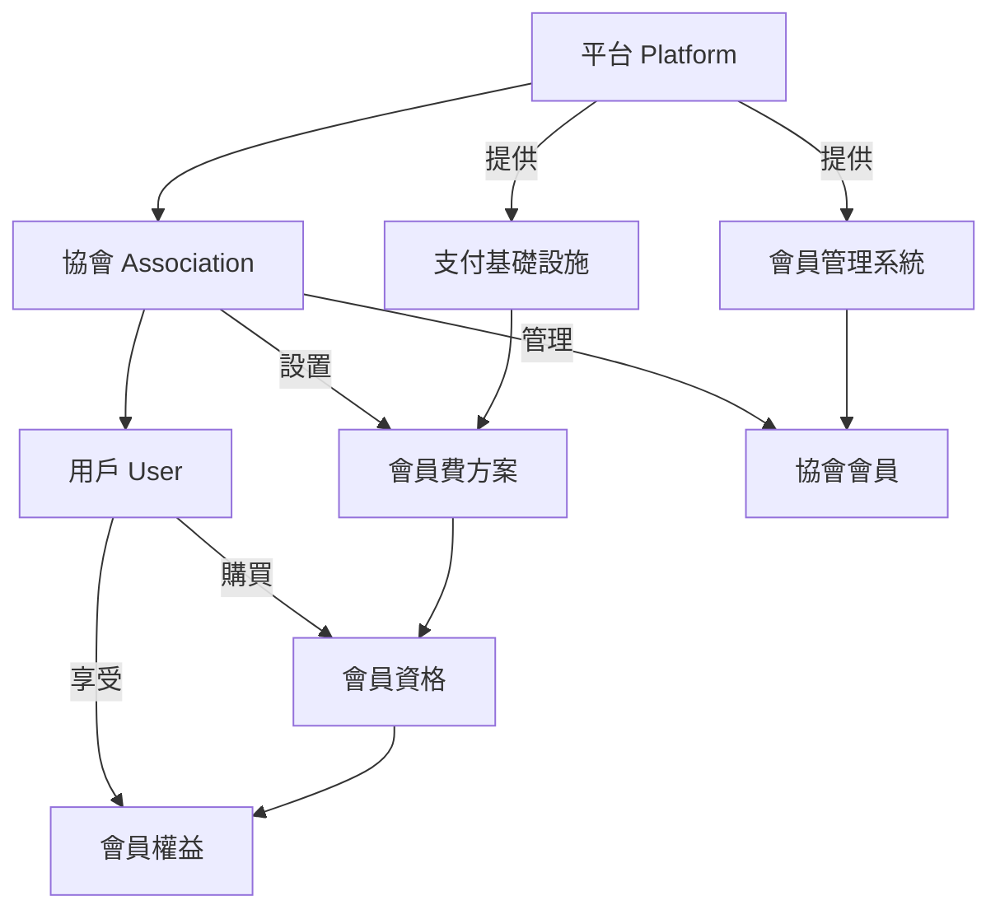

### 技術架構總覽

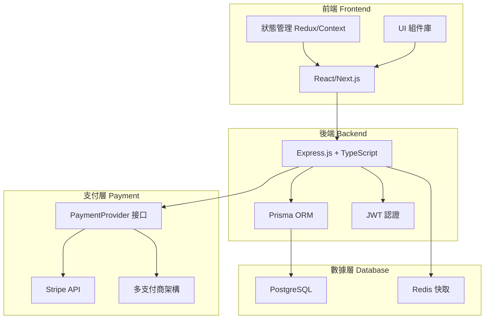

## 👥 用戶角色與權限

### 角色權限關係圖

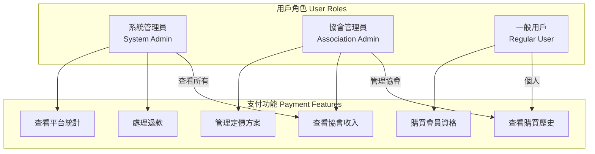

### 頁面訪問權限矩陣

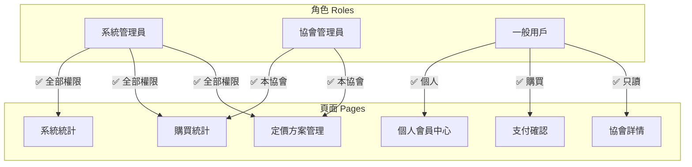

## 🔄 核心業務流程

### 完整支付流程時序圖

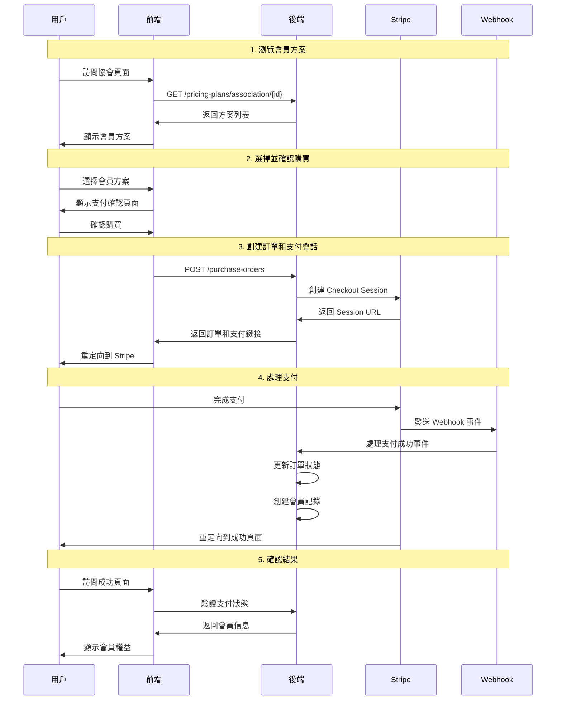

### 協會管理員工作流程

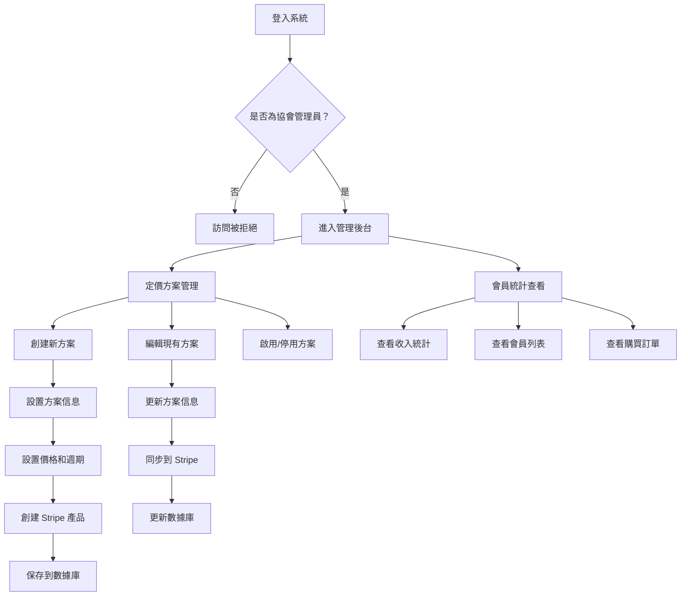

## 🎯 核心頁面需求與結構

### 頁面導航結構圖

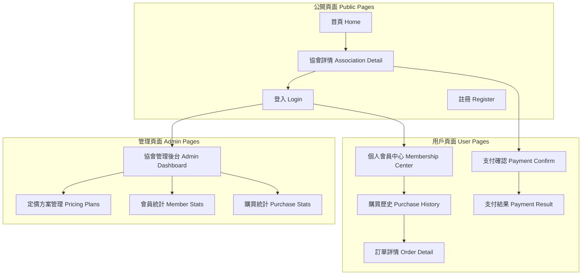

### 協會詳情頁面組件結構

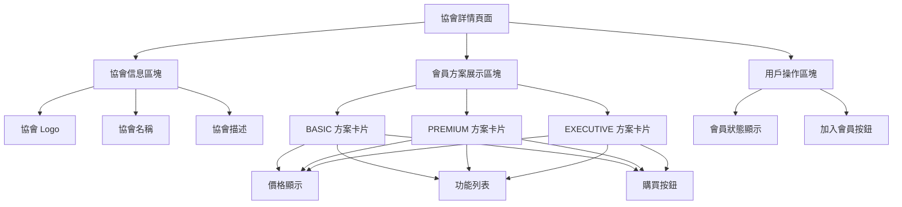

### 支付確認頁面流程

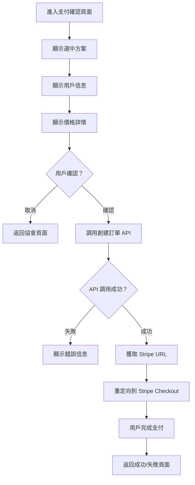

## 🔧 API 整合架構

### API 端點結構圖

```mermaid
graph TB
    subgraph "API 路由 API Routes"
        A[/api/payment]
    end
    
    subgraph "定價方案 Pricing Plans"
        B[GET /pricing-plans/association/{id}]
        C[GET /pricing-plans/{id}]
        D[POST /pricing-plans]
        E[PATCH /pricing-plans/{id}]
        F[PATCH /pricing-plans/{id}/activate]
        G[PATCH /pricing-plans/{id}/deactivate]
    end
    
    subgraph "購買訂單 Purchase Orders"
        H[POST /purchase-orders]
        I[GET /purchase-orders]
        J[GET /purchase-orders/{id}]
        K[POST /purchase-orders/webhook]
    end
    
    A --> B
    A --> C
    A --> D
    A --> E
    A --> F
    A --> G
    A --> H
    A --> I
    A --> J
    A --> K
```

### 數據流程圖

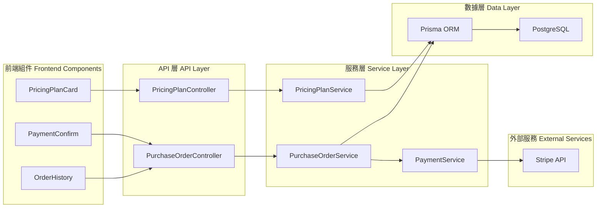

## 📊 數據庫關係圖

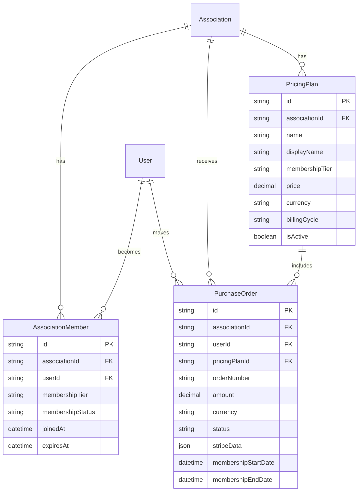

## 🎨 UI/UX 設計指南

### 會員方案卡片設計

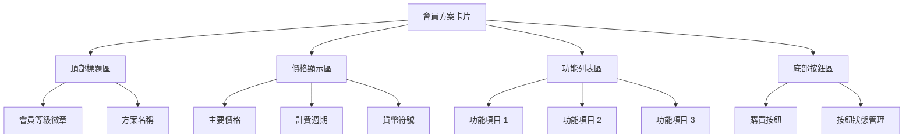

### 響應式設計斷點

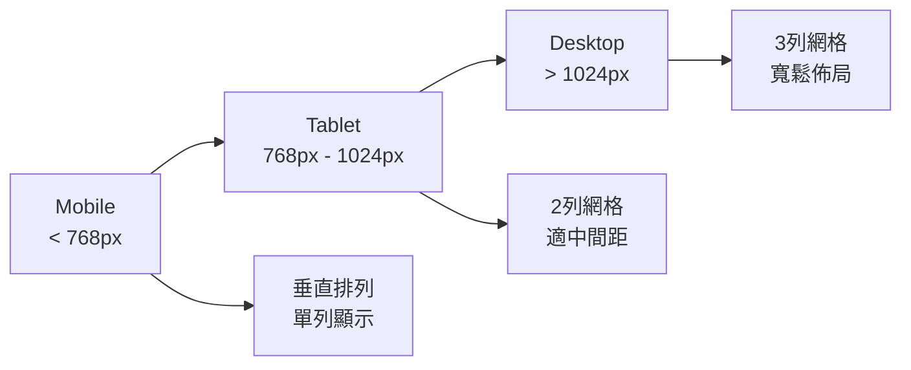

## 🔄 狀態管理架構

### Redux/Context 狀態樹

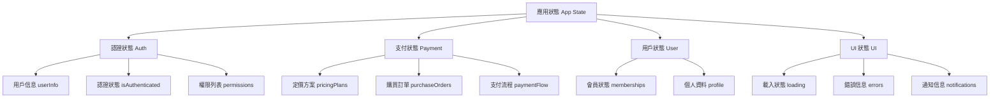

### 狀態更新流程

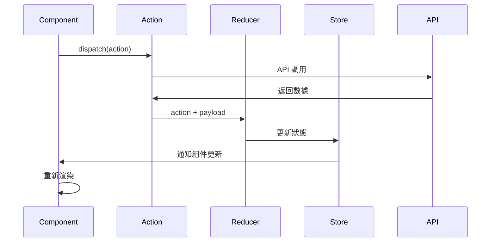

## 🛠️ 開發工作流程

### 功能開發流程

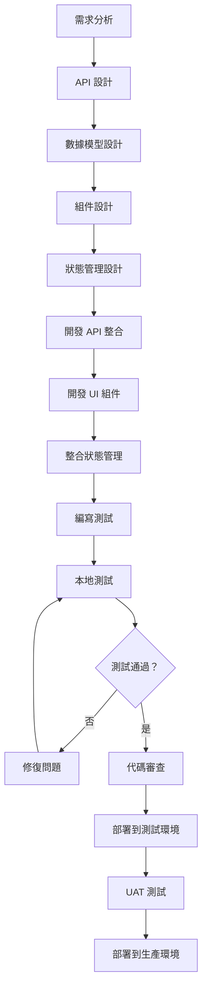

### Git 分支策略

```mermaid
gitgraph
    commit id: "初始化"
    branch develop
    checkout develop
    commit id: "開發環境設置"
    
    branch feature/payment-ui
    checkout feature/payment-ui
    commit id: "支付頁面組件"
    commit id: "支付流程邏輯"
    
    checkout develop
    merge feature/payment-ui
    
    branch feature/admin-dashboard
    checkout feature/admin-dashboard
    commit id: "管理後台頁面"
    commit id: "統計圖表組件"
    
    checkout develop
    merge feature/admin-dashboard
    
    checkout main
    merge develop
    commit id: "發布 v1.0"
```

## 🧪 測試策略

### 測試金字塔

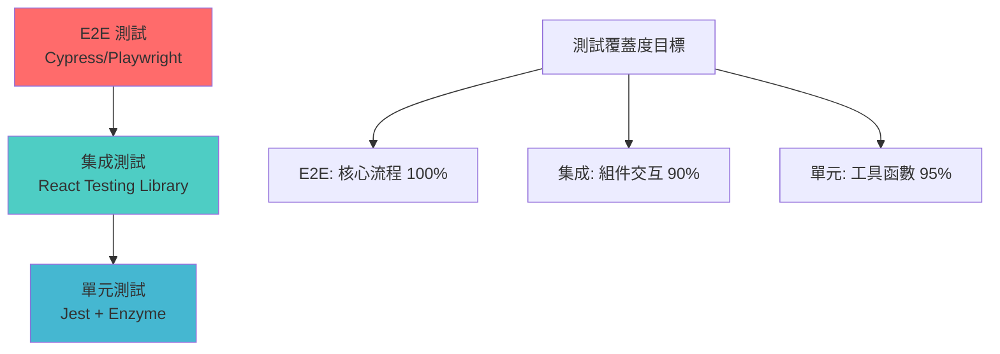

### 支付流程測試案例

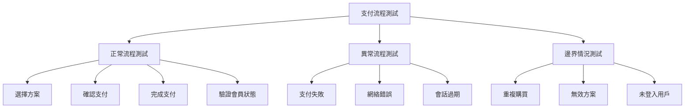

## 🚀 部署與監控

### 部署流程圖

```mermaid
graph TD
    A[代碼提交] --> B[CI/CD 流水線]
    B --> C[構建應用]
    C --> D[運行測試]
    D --> E{測試通過？}
    
    E -->|否| F[通知開發者]
    E -->|是| G[構建 Docker 鏡像]
    
    G --> H[推送到倉庫]
    H --> I[部署到測試環境]
    I --> J[自動化測試]
    J --> K{測試通過？}
    
    K -->|否| L[回滾版本]
    K -->|是| M[部署到生產環境]
    
    M --> N[健康檢查]
    N --> O[監控告警]
```

### 監控指標

```mermaid
graph TB
    A[監控指標] --> B[性能指標]
    A --> C[業務指標]
    A --> D[錯誤指標]
    
    B --> E[頁面載入時間]
    B --> F[API 響應時間]
    B --> G[資源使用率]
    
    C --> H[支付成功率]
    C --> I[用戶轉換率]
    C --> J[會員增長率]
    
    D --> K[API 錯誤率]
    D --> L[支付失敗率]
    D --> M[頁面錯誤率]
```

## 📱 移動端適配

### 響應式組件設計

```mermaid
graph TD
    A[響應式設計] --> B[斷點設計]
    A --> C[組件適配]
    A --> D[交互優化]
    
    B --> E[Mobile: 320px-768px]
    B --> F[Tablet: 768px-1024px]
    B --> G[Desktop: 1024px+]
    
    C --> H[卡片式佈局]
    C --> I[可收縮側欄]
    C --> J[底部固定按鈕]
    
    D --> K[觸控友好]
    D --> L[快速支付]
    D --> M[簡化流程]
```

### PWA 功能規劃

```mermaid
graph LR
    A[PWA 功能] --> B[離線支持]
    A --> C[推送通知]
    A --> D[應用安裝]
    
    B --> E[快取關鍵頁面]
    B --> F[離線提示]
    
    C --> G[支付完成通知]
    C --> H[會員到期提醒]
    
    D --> I[添加到主螢幕]
    D --> J[啟動畫面]
```

## 🔒 安全考慮

### 前端安全檢查清單

```mermaid
graph TD
    A[前端安全] --> B[認證安全]
    A --> C[數據安全]
    A --> D[支付安全]
    
    B --> E[Token 管理]
    B --> F[會話過期]
    B --> G[權限檢查]
    
    C --> H[輸入驗證]
    C --> I[XSS 防護]
    C --> J[CSRF 防護]
    
    D --> K[PCI DSS 合規]
    D --> L[敏感信息處理]
    D --> M[Stripe Elements]
```

## 📋 開發檢查清單

### 功能完成檢查

```mermaid
graph TD
    A[功能檢查清單] --> B[核心功能]
    A --> C[用戶體驗]
    A --> D[性能優化]
    A --> E[安全檢查]
    
    B --> F[✅ API 整合]
    B --> G[✅ 支付流程]
    B --> H[✅ 狀態管理]
    
    C --> I[✅ 響應式設計]
    C --> J[✅ 載入狀態]
    C --> K[✅ 錯誤處理]
    
    D --> L[✅ 代碼分割]
    D --> M[✅ 圖片優化]
    D --> N[✅ 快取策略]
    
    E --> O[✅ 輸入驗證]
    E --> P[✅ 權限控制]
    E --> Q[✅ 敏感信息保護]
```

這個擴展版本的文檔包含了豐富的 Mermaid 圖表，能夠幫助前端工程師更直觀地理解整個支付系統的架構、流程和實現細節。圖表涵蓋了從系統架構到具體實現的各個層面，讓開發工作更加清晰和高效。 