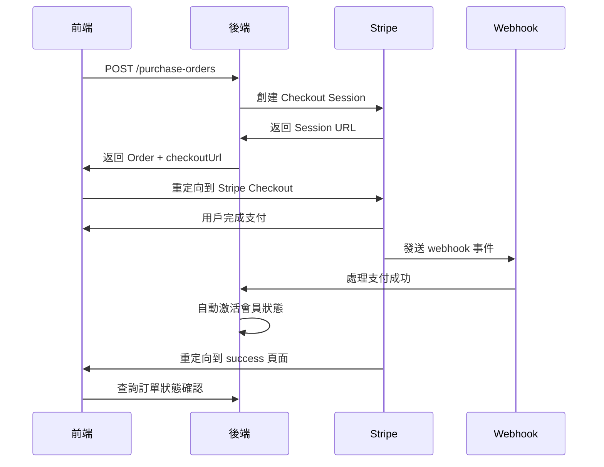

# 前端工程師 API 集成指南

## 📋 **重要說明**
我們的支付系統採用 **Purchase Order + Stripe Checkout** 模式，比傳統的 PaymentIntent 模式更安全和完整。

## 🔄 **API映射對照表**

### 支付流程 API

| 前端期望的API | 我們實際的API | 說明 |
|--------------|--------------|------|
| `POST /api/payments/create-intent` | `POST /api/payment/purchase-orders` | 創建購買訂單+獲取Stripe Checkout URL |
| `GET /api/payments/status/{id}` | `GET /api/payment/purchase-orders/{id}` | 獲取訂單狀態（包含支付狀態） |
| `POST /api/payments/webhook/*` | `POST /api/payment/purchase-orders/webhook` | 統一的Stripe webhook處理 |

### 會員管理 API

| 前端需求 | 我們的API | 狀態 |
|---------|----------|------|
| 添加會員 | `POST /api/association/associations/{id}/members` | ✅ 已實現 |
| 查詢會員狀態 | `GET /api/association/associations/{id}/check-membership` | ✅ 已實現 |
| 更新會員狀態 | `PATCH /api/association/associations/{id}/members/{userId}/status` | ✅ 已實現 |

## 🚀 **正確的支付流程實現**

### 1. 創建購買訂單
```typescript
// 前端調用
const response = await fetch('/api/payment/purchase-orders', {
  method: 'POST',
  headers: {
    'Authorization': `Bearer ${token}`,
    'Content-Type': 'application/json'
  },
  body: JSON.stringify({
    pricingPlanId: planId,
    successUrl: `${window.location.origin}/payment/success`,
    cancelUrl: `${window.location.origin}/payment/cancel`
  })
});

const { order, checkoutUrl } = await response.json();

// 重定向到 Stripe Checkout
window.location.href = checkoutUrl;
```

### 2. 處理支付結果
```typescript
// 在 success 頁面，查詢訂單狀態
const orderId = new URLSearchParams(window.location.search).get('order_id');
const response = await fetch(`/api/payment/purchase-orders/${orderId}`, {
  headers: { 'Authorization': `Bearer ${token}` }
});

const { order } = await response.json();
if (order.status === 'PAID') {
  // 支付成功，會員狀態已自動激活
  showSuccessMessage();
}
```

### 3. 檢查會員狀態
```typescript
// 檢查用戶在協會的會員狀態
const response = await fetch(`/api/association/associations/${associationId}/check-membership`, {
  headers: { 'Authorization': `Bearer ${token}` }
});

const membershipStatus = await response.json();
```

## 🎯 **為什麼我們的設計更好**

### Purchase Order 模式的優勢：
1. **完整的訂單跟蹤** - 每筆交易都有完整記錄
2. **自動化處理** - 支付成功後自動激活會員狀態
3. **安全性更高** - 使用 Stripe Checkout，減少 PCI 合規要求
4. **用戶體驗更好** - 統一的支付界面，支持多種支付方式
5. **錯誤處理更完善** - 完整的狀態管理和錯誤恢復機制

### PaymentIntent 模式的限制：
1. 需要自己處理支付表單
2. 需要自己管理支付狀態
3. PCI 合規要求更高
4. 錯誤處理更複雜

## 📊 **數據流程圖**



## 🛠️ **實際需要的前端頁面**

基於我們的API設計，前端實際需要：

### 1. 定價方案選擇頁面
```typescript
// 獲取協會的定價方案
fetch(`/api/payment/pricing-plans/association/${associationId}`)
```

### 2. 支付確認頁面 (可選)
```typescript
// 顯示選中方案，確認後調用購買API
fetch('/api/payment/purchase-orders', { method: 'POST', ... })
```

### 3. 支付成功/失敗頁面
```typescript
// 從URL參數獲取訂單ID，查詢狀態
fetch(`/api/payment/purchase-orders/${orderId}`)
```

## ✅ **檢查清單**

### 後端已完成 ✅
- [x] 完整的購買訂單 API
- [x] Stripe Checkout 集成  
- [x] Webhook 事件處理
- [x] 自動會員狀態管理
- [x] 完整的錯誤處理

### 前端需要實現
- [ ] 使用正確的API端點
- [ ] 實現 Stripe Checkout 重定向流程
- [ ] 支付結果頁面
- [ ] 會員狀態顯示

## 🔧 **環境配置確認**

確認以下環境變數已設置：
```env
STRIPE_SECRET_KEY=sk_test_...
STRIPE_WEBHOOK_SECRET=whsec_...
```

Stripe Dashboard Webhook 配置：
- 端點: `{your_domain}/api/payment/purchase-orders/webhook`
- 事件: `checkout.session.completed`, `invoice.payment_succeeded`

## 📞 **技術支持**

如果前端遇到任何問題：
1. 先檢查是否使用了正確的API端點
2. 確認請求格式符合我們的文檔
3. 檢查響應數據結構
4. 聯繫後端團隊進行聯調測試 