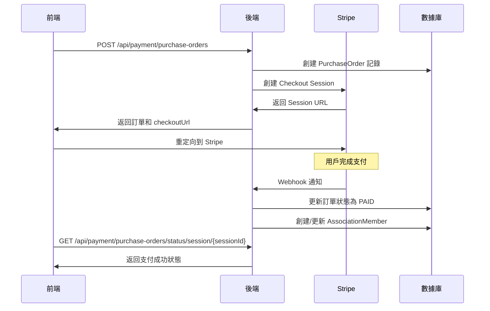
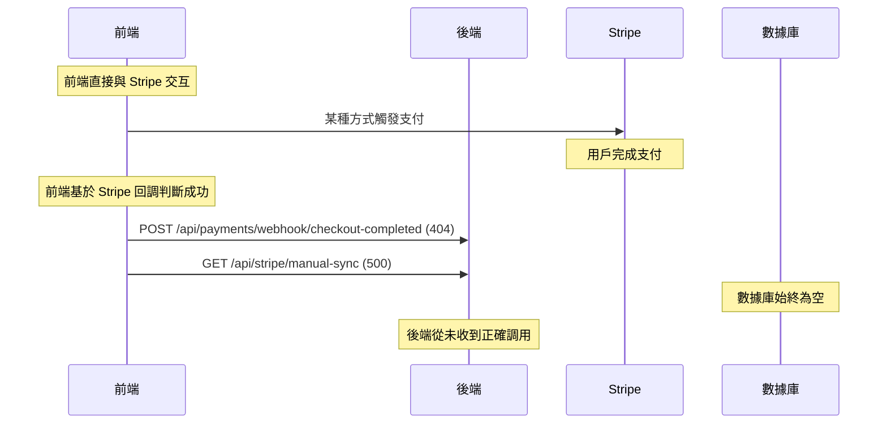

# NFC LinkCard Express 支付系統問題根因分析

## 🎯 **問題核心總結**

**用戶的疑問**：「整個流程很簡單，為什麼會卡這麼久？」

**答案**：流程設計確實很簡單，後端實現也很完整，但問題出在**前後端 API 規範不一致**，導致前端從來沒有成功調用過正確的後端 API。

## 📊 **完整的來龍去脈時間線**

### 第一階段：設計與實現（已完成）✅

**後端團隊完成了：**
1. **數據模型設計**：
   - `Association` (協會)
   - `PricingPlan` (定價方案)
   - `PurchaseOrder` (購買訂單)
   - `AssociationMember` (協會會員)

2. **完整的支付流程**：
   ```
   用戶選擇會籍 → 創建訂單 → Stripe支付 → Webhook處理 → 自動激活會員
   ```

3. **API 端點實現**：
   - `POST /api/payment/purchase-orders` - 創建訂單
   - `GET /api/payment/purchase-orders/status/session/{sessionId}` - 查詢狀態
   - `POST /api/payment/purchase-orders/webhook` - Stripe webhook

4. **文檔創建**：
   - API 文檔
   - 前端集成指南
   - 錯誤處理指南

### 第二階段：集成問題（問題根源）❌

**前端工程師的實際調用**：
- ❌ `POST /api/payments/webhook/checkout-completed` (404 錯誤)
- ❌ `GET /api/stripe/manual-sync` (500 錯誤)

**應該調用的正確端點**：
- ✅ `POST /api/payment/purchase-orders`
- ✅ `GET /api/payment/purchase-orders/status/session/{sessionId}`
- ✅ `POST /api/payment/purchase-orders/webhook`

### 第三階段：錯誤診斷（當前狀態）🔍

**發現的問題**：
1. `purchase_orders` 表完全為空 (0 記錄)
2. 前端認為支付成功，但後端沒有任何記錄
3. Session ID `cs_test_a1Nf1jSwVJaIZXXH8U9lolT1j7QXgNQ3V2gU2R2yO4nKX1PqNzOORuRNKQ` 不存在於數據庫

## 🔍 **根因分析：為什麼會出現 API 不匹配？**

### 1. **溝通斷層**
- 前端工程師可能沒有看到或理解 `docs/FRONTEND_API_INTEGRATION_GUIDE.md`
- 前端可能基於其他項目經驗或假設進行開發
- 缺乏前後端的聯合測試和驗證

### 2. **文檔傳達問題**
雖然後端創建了詳細的文檔，但可能：
- 文檔沒有及時傳達給前端團隊
- 文檔的重要性沒有被強調
- 前端團隊可能使用了過時的或錯誤的 API 規範

### 3. **測試流程缺陷**
- 沒有進行端到端的集成測試
- 前端基於 Stripe 前端回調判斷成功，而不是後端確認
- 缺乏對數據庫狀態的驗證

## 🚨 **關鍵發現：前端的錯誤假設**

前端工程師可能認為：
1. **支付成功 = Stripe 前端回調成功**
2. **可以直接觸發 webhook** (這是安全風險)
3. **API 端點基於常見模式** (`/api/payments` 而不是 `/api/payment`)

實際上應該是：
1. **支付成功 = 後端訂單狀態為 PAID**
2. **Webhook 只能由 Stripe 觸發**
3. **必須使用項目特定的 API 規範**

## 💡 **理想 vs 實際流程對比**

### 理想流程（設計的）：


### 實際發生的流程：


## 🎯 **立即行動計劃**

### 1. **前端工程師立即行動**（今天）
```typescript
// 1. 停止使用錯誤的端點
// ❌ 不要再調用這些：
// POST /api/payments/webhook/checkout-completed
// GET /api/stripe/manual-sync

// 2. 使用正確的流程
// ✅ 正確的創建訂單流程：
const response = await fetch('/api/payment/purchase-orders', {
  method: 'POST',
  headers: {
    'Authorization': `Bearer ${token}`,
    'Content-Type': 'application/json'
  },
  body: JSON.stringify({
    pricingPlanId: 'your-pricing-plan-id',
    successUrl: `${window.location.origin}/payment/success`,
    cancelUrl: `${window.location.origin}/payment/cancel`
  })
});

const { order, checkoutUrl } = await response.json();
// 重定向到 Stripe Checkout
window.location.href = checkoutUrl;
```

### 2. **後端工程師立即行動**（今天）
- ✅ 監控服務器日誌，確認是否收到正確的 API 調用
- ✅ 準備協助前端進行聯合測試
- ✅ 確保數據庫連接和 Stripe 配置正確

### 3. **聯合測試**（今天/明天）
1. 前端使用正確的 API 端點創建一個測試訂單
2. 驗證數據庫中是否創建了 `purchase_orders` 記錄
3. 完成一次完整的支付流程測試
4. 確認會員狀態是否正確激活

## 🛡️ **防止未來問題的措施**

### 1. **強化溝通機制**
- 建立前後端 API 規範確認流程
- 要求前端在開始開發前確認 API 端點
- 定期進行前後端同步會議

### 2. **改進文檔流程**
- API 文檔變更時必須通知前端團隊
- 創建 API 變更日誌
- 提供 Postman 集合或類似的 API 測試工具

### 3. **建立測試流程**
- 要求每個新功能都進行端到端測試
- 建立自動化的集成測試
- 前端部署前必須驗證與後端的集成

### 4. **技術改進**
- 考慮使用 OpenAPI/Swagger 自動生成前端 SDK
- 建立 API 版本管理機制
- 加強錯誤日誌和監控

## 📈 **預期結果**

按照正確的流程實施後：
1. **今天**：前端能成功創建訂單，數據庫中出現 `purchase_orders` 記錄
2. **明天**：完整的支付流程能正常工作
3. **本週**：會員購買和激活功能完全正常
4. **長期**：建立穩定的前後端協作機制

## 🎉 **總結**

**問題不在於技術複雜性，而在於協作和溝通。**

- ✅ 後端設計和實現都是正確的
- ✅ 支付流程設計是業界標準的
- ❌ 前端使用了錯誤的 API 規範
- ❌ 缺乏有效的前後端協作驗證

**解決方案很簡單**：前端使用正確的 API 端點，進行一次完整的集成測試即可。

**這個問題給我們的教訓**：再好的技術實現，如果沒有有效的團隊協作和溝通，也會導致項目延期。 