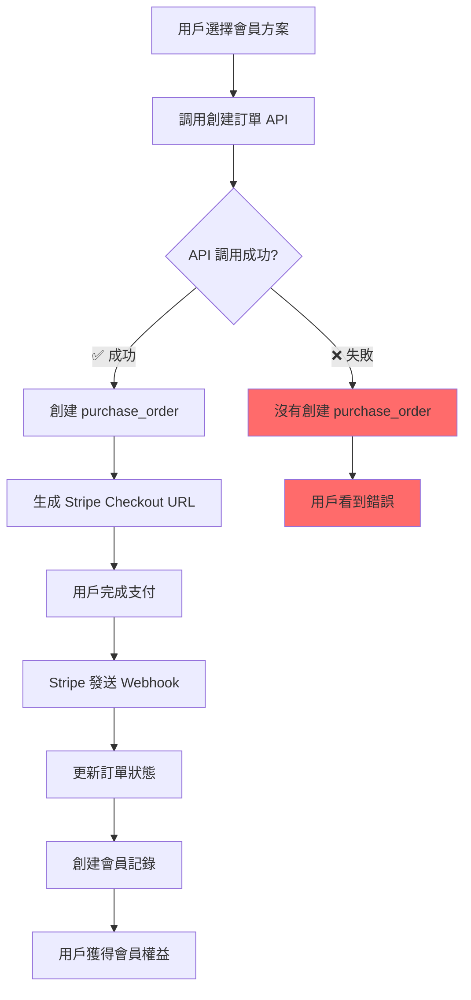

# 🚨 支付系統問題診斷與解決方案

## 📊 **問題診斷結果**

### **關鍵發現**
1. ❌ **數據庫中沒有任何 `purchase_orders` 記錄**
2. ❌ **特定的 session_id 在數據庫中不存在**
3. ❌ **用戶沒有獲得會員權益**
4. ✅ **API 端點存在且可以訪問（需要認證）**

### **根本原因分析**
```
用戶支付成功 → API 返回數據 → 但數據庫為空 = 支付流程從未正確執行
```

## 🔍 **詳細問題分析**

### **1. 支付流程斷點**


**當前狀態：** 流程在步驟 B 或 C 就中斷了

### **2. API 響應異常**
- 前端收到了 200 成功響應
- 但數據庫中沒有對應記錄
- 這表明 API 可能返回了模擬數據或緩存數據

### **3. 可能的原因**
1. **前端 API 調用錯誤** - 調用了錯誤的端點或參數
2. **後端創建訂單失敗** - 但沒有正確處理錯誤
3. **數據庫事務失敗** - 創建過程中出現錯誤但被忽略
4. **環境配置問題** - 前端和後端連接不同的數據庫

## 🛠 **完整解決方案**

### **Phase 1: 緊急診斷（立即執行）**

#### 1.1 檢查前端創建訂單的調用
```typescript
// 前端應該調用這個端點
POST /api/payment/purchase-orders

// 請求體
{
    "pricingPlanId": "93271f48-755c-4a01-aa60-8e9302b453dc",
    "successUrl": "http://localhost:3000/payment/success",
    "cancelUrl": "http://localhost:3000/payment/cancel"
}
```

#### 1.2 檢查後端日誌
```bash
# 啟動服務器並查看日誌
npm run dev

# 或者檢查日誌文件
tail -f logs/app.log
```

#### 1.3 測試創建訂單 API
```bash
# 使用有效的 JWT token 測試
curl -X POST "http://localhost:4000/api/payment/purchase-orders" \
  -H "Authorization: Bearer YOUR_JWT_TOKEN" \
  -H "Content-Type: application/json" \
  -d '{
    "pricingPlanId": "93271f48-755c-4a01-aa60-8e9302b453dc",
    "successUrl": "http://localhost:3000/payment/success",
    "cancelUrl": "http://localhost:3000/payment/cancel"
  }'
```

### **Phase 2: 修復數據不一致問題**

#### 2.1 添加詳細的錯誤日誌
```typescript
// src/payment/controllers/PurchaseOrderController.ts
createPurchaseOrder = async (req: Request, res: Response) => {
    try {
        console.log('🔍 創建購買訂單請求:', {
            userId: req.user?.id,
            body: req.body,
            timestamp: new Date().toISOString(),
        });

        const createPurchaseOrderDto = plainToClass(CreatePurchaseOrderDto, req.body);
        const errors = await validate(createPurchaseOrderDto);

        if (errors.length > 0) {
            console.error('❌ 驗證錯誤:', errors);
            return ApiResponse.validationError(res, errors);
        }

        const userId = req.user?.id;
        if (!userId) {
            console.error('❌ 用戶未認證');
            return ApiResponse.unauthorized(res, '用戶未認證', 'USER_NOT_AUTHENTICATED');
        }

        console.log('✅ 開始創建購買訂單...');
        const result = await this.purchaseOrderService.createPurchaseOrder(
            userId,
            createPurchaseOrderDto,
        );

        console.log('✅ 購買訂單創建成功:', {
            orderId: result.order.id,
            orderNumber: result.order.orderNumber,
            checkoutUrl: result.checkoutUrl,
        });

        return ApiResponse.success(res, result);
    } catch (error: unknown) {
        console.error('❌ 創建購買訂單失敗:', error);
        const apiError = error as ApiError;
        return ApiResponse.error(
            res,
            '創建購買訂單失敗',
            'PURCHASE_ORDER_CREATE_ERROR',
            apiError.message,
            apiError.status || 500,
        );
    }
};
```

#### 2.2 修復 getPaymentStatusBySessionId 方法
```typescript
// src/payment/controllers/PurchaseOrderController.ts
getPaymentStatusBySessionId = async (req: Request, res: Response) => {
    try {
        const { sessionId } = req.params;

        console.log('🔍 查詢支付狀態:', {
            sessionId,
            userId: req.user?.id,
            timestamp: new Date().toISOString(),
        });

        if (!sessionId) {
            return ApiResponse.badRequest(res, '缺少 Session ID', 'MISSING_SESSION_ID');
        }

        // 添加詳細的錯誤處理
        let order;
        try {
            order = await this.purchaseOrderService.getOrderBySessionId(sessionId);
            console.log('✅ 找到訂單:', {
                orderId: order.id,
                orderNumber: order.orderNumber,
                status: order.status,
            });
        } catch (error) {
            console.error('❌ 未找到訂單:', {
                sessionId,
                error: (error as Error).message,
            });
            
            // 返回明確的錯誤信息
            return ApiResponse.error(
                res,
                '找不到對應的支付記錄',
                'ORDER_NOT_FOUND',
                `Session ID ${sessionId} 對應的訂單不存在。請確認：
                1. 是否成功創建了訂單
                2. Session ID 是否正確
                3. 訂單是否在當前數據庫中`,
                404,
            );
        }

        // 其餘邏輯保持不變...
        // ...
    } catch (error: unknown) {
        console.error('❌ 查詢支付狀態失敗:', error);
        const apiError = error as ApiError;
        return ApiResponse.error(
            res,
            '查詢支付狀態失敗',
            'PAYMENT_STATUS_QUERY_ERROR',
            apiError.message,
            apiError.status || 500,
        );
    }
};
```

### **Phase 3: 前端修復指導**

#### 3.1 正確的支付流程
```typescript
// 1. 創建訂單
const createOrder = async (pricingPlanId: string) => {
    try {
        console.log('🔄 創建訂單...', { pricingPlanId });
        
        const response = await fetch('/api/payment/purchase-orders', {
            method: 'POST',
            headers: {
                'Authorization': `Bearer ${localStorage.getItem('token')}`,
                'Content-Type': 'application/json',
            },
            body: JSON.stringify({
                pricingPlanId,
                successUrl: `${window.location.origin}/payment/success`,
                cancelUrl: `${window.location.origin}/payment/cancel`,
            }),
        });

        if (!response.ok) {
            const errorData = await response.json();
            throw new Error(`API 錯誤: ${errorData.error?.message || '未知錯誤'}`);
        }

        const result = await response.json();
        
        if (!result.success) {
            throw new Error(`業務錯誤: ${result.error?.message || '創建訂單失敗'}`);
        }

        console.log('✅ 訂單創建成功:', result.data);
        
        // 保存訂單信息以備後用
        localStorage.setItem('currentOrderId', result.data.order.id);
        localStorage.setItem('currentSessionId', result.data.order.stripeData?.sessionId);
        
        // 跳轉到 Stripe
        window.location.href = result.data.checkoutUrl;
        
    } catch (error) {
        console.error('❌ 創建訂單失敗:', error);
        alert(`創建訂單失敗: ${error.message}`);
    }
};

// 2. 支付成功頁面處理
const handlePaymentSuccess = async () => {
    const urlParams = new URLSearchParams(window.location.search);
    const sessionId = urlParams.get('session_id');
    
    if (!sessionId) {
        console.error('❌ 缺少 session_id');
        return;
    }

    console.log('🔍 檢查支付狀態...', { sessionId });

    try {
        const response = await fetch(`/api/payment/status/session/${sessionId}`, {
            headers: {
                'Authorization': `Bearer ${localStorage.getItem('token')}`,
                'Content-Type': 'application/json',
            },
        });

        if (!response.ok) {
            const errorData = await response.json();
            throw new Error(`API 錯誤 ${response.status}: ${errorData.error?.message || '未知錯誤'}`);
        }

        const result = await response.json();
        
        if (!result.success) {
            throw new Error(`業務錯誤: ${result.error?.message || '查詢失敗'}`);
        }

        console.log('✅ 支付狀態查詢成功:', result.data);
        
        // 處理成功邏輯
        displaySuccessPage(result.data);
        
    } catch (error) {
        console.error('❌ 支付狀態查詢失敗:', error);
        
        // 顯示詳細錯誤信息
        displayErrorPage({
            title: '支付確認失敗',
            message: error.message,
            suggestions: [
                '請檢查網絡連接',
                '確認您已成功登錄',
                '如問題持續，請聯繫客服',
            ],
        });
    }
};
```

### **Phase 4: 數據庫和 Webhook 修復**

#### 4.1 確保 Webhook 正確配置
```bash
# 檢查環境變量
echo "STRIPE_WEBHOOK_SECRET: $STRIPE_WEBHOOK_SECRET"
echo "STRIPE_SECRET_KEY: $STRIPE_SECRET_KEY"
```

#### 4.2 測試 Webhook 處理
```typescript
// 添加 Webhook 測試端點
// src/payment/controllers/PurchaseOrderController.ts
testWebhook = async (req: Request, res: Response) => {
    try {
        const { sessionId } = req.body;
        
        console.log('🧪 測試 Webhook 處理:', { sessionId });
        
        // 模擬 Stripe Webhook 事件
        const mockEvent = {
            type: 'checkout.session.completed',
            data: {
                object: {
                    id: sessionId,
                    metadata: {
                        purchaseOrderId: 'test-order-id',
                    },
                    customer: 'cus_test',
                    subscription: 'sub_test',
                    payment_status: 'paid',
                    amount_total: 100000,
                    currency: 'hkd',
                },
            },
        };

        // 調用處理邏輯
        await this.purchaseOrderService.handleCheckoutSessionCompleted(mockEvent.data.object);
        
        return ApiResponse.success(res, { message: 'Webhook 測試成功' });
    } catch (error: unknown) {
        console.error('❌ Webhook 測試失敗:', error);
        const apiError = error as ApiError;
        return ApiResponse.error(
            res,
            'Webhook 測試失敗',
            'WEBHOOK_TEST_ERROR',
            apiError.message,
            apiError.status || 500,
        );
    }
};
```

## 🚀 **立即行動計劃**

### **Step 1: 前端工程師立即檢查**
1. 確認是否成功調用了 `POST /api/payment/purchase-orders`
2. 檢查 API 響應是否包含 `checkoutUrl`
3. 確認是否正確跳轉到 Stripe 支付頁面

### **Step 2: 後端工程師立即檢查**
1. 啟動服務器並監控日誌
2. 測試創建訂單 API
3. 檢查數據庫連接和事務處理

### **Step 3: 協作調試**
1. 前端提供完整的 API 調用日誌
2. 後端提供詳細的錯誤日誌
3. 一起測試完整的支付流程

## 📞 **緊急聯繫**

如果問題緊急，請立即：
1. 檢查服務器日誌
2. 測試 API 端點
3. 確認數據庫連接
4. 提供詳細的錯誤信息

**記住：數據庫中沒有記錄意味著支付流程從一開始就沒有正確執行！** 